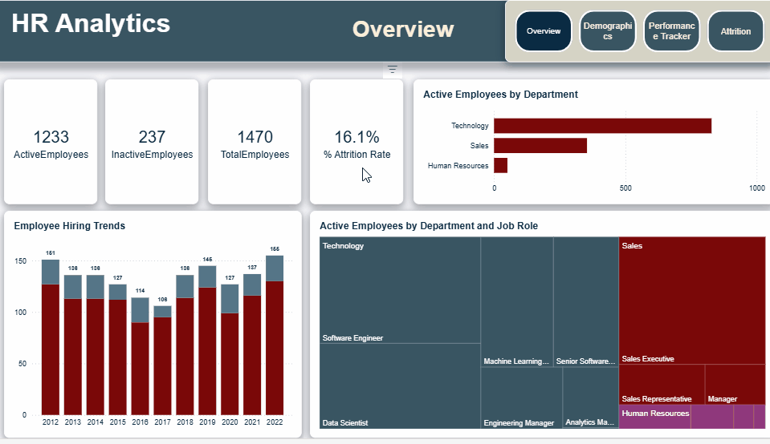

# 📊 HR Analytics Dashboard — Atlas Labs

> A Power BI case study exploring employee attrition, demographics, and performance for a fictitious software company.

---

## 🧩 Project Overview

Atlas Labs is facing a rising employee turnover challenge. HR has the data — but no clear story.

This project builds an end-to-end HR Analytics dashboard in Power BI that transforms raw employee records into actionable insights, helping leadership understand **who is leaving, why, and what can be done about it.**

---

## 📁 Repository Structure

```
hr-analytics-powerbi/
│
├── dashboard.pbix               # Main Power BI report file
├── README.md               # Project documentation 
└── assets/
    └── screenshots/        # Dashboard preview images 
```

---

## 🗂️ Dashboard Pages

| Page | Description |
|------|-------------|
| **Overview** | High-level KPIs: total headcount, active employees, attrition rate |
| **Attrition Analysis** | Deep-dive into which departments, roles, and demographics are most affected |
| **Demographics** | Workforce breakdown by age, gender, education, and tenure |
| **Performance Tracking** | Employee performance ratings over time, by department and job level |

---
## 📊 Live Dashboard

[](https://app.powerbi.com/view?r=eyJrIjoiMTY5YWMyMjktODViYS00ZDJhLTk1MmQtZTllMjU3N2JjZDM2IiwidCI6ImRmODY3OWNkLWE4MGUtNDVkOC05OWFjLWM4M2VkN2ZmOTVhMCJ9)

> Click the badge above to explore the full interactive report.
---
## 
---
## 🔍 Problem Statement

> *"We know people are leaving — but we don't know why, and we don't know who's next."*

Atlas Labs needed a reporting solution that could:
- Quantify attrition trends across departments
- Surface correlations between employee attributes and turnover
- Provide a clean, stakeholder-ready report for HR leadership

---

## 🛠️ Approach

### Chapter 1 — Data Modeling & Exploratory Analysis
- Imported and cleaned HR data in Power BI
- Built a star-schema data model connecting employee, performance, and satisfaction tables
- Ran initial EDA to identify key HR trends and data quality issues

### Chapter 2 — Demographics & Performance Analysis
- Created custom DAX measures for headcount, attrition rate, average tenure, and ratings
- Built visuals segmenting the workforce by department, age group, gender, and education level
- Analyzed performance ratings distribution across job levels

### Chapter 3 — Attrition Deep-Dive & Report Design
- Identified the key factors driving attrition (department, job role, overtime, satisfaction score)
- Built an attrition breakdown page with filters for dynamic exploration
- Applied a clean, branded design with consistent color palette and typography

---

## 📐 Key DAX Measures

```dax
-- Total Employees
    TotalEmployees =
DISTINCTCOUNT(DimEmployee[EmployeeID])
    - DISTINCTCOUNT is used to count unique employees based on EmployeeID,
    - ensuring each employee is counted once even if multiple records exist.

--Total EmployeesDate
    TotalEmployeesDate = 
CALCULATE (
    [TotalEmployees],
    USERELATIONSHIP ( DimEmployee[HireDate], DimDate[Date] )
)

-- Active Employees
ActiveEmployees =
CALCULATE([TotalEmployees],
    FILTER(DimEmployee, DimEmployee[Attrition] = "No")
         )

-- Inactive Employees
 InactiveEmployees =
 CALCULATE([TotalEmployees],
FILTER(DimEmployee, DimEmployee[Attrition] = "Yes")
          )

-- Inactive Employees By Date
InactiveEmployeesDate =
 CALCULATE( [InactiveEmployees] , 
    USERELATIONSHIP(DimEmployee[HireDate],DimDate[Date]))
    - USERELATIONSHIP activates an inactive relationship in the data model so the measure
    - can calculate results based on that specific relationship.

-- Attrition Rate
% Attrition Rate =
    DIVIDE([InactiveEmployees], [TotalEmployees])

-- Attrition Rate By Date
 % Attrition Rate Date =
     DIVIDE( [InactiveEmployeesDate] , [TotalEmployeesDate])

-- Last Review Date
    LastReviewDate = 
IF (
    MAX ( FactPerformanceRating[ReviewDate] ) = BLANK (),
    "No Review Yet",
    MAX ( FactPerformanceRating[ReviewDate] )
)

-- Average Salary
AverageSalary =
    AVERAGE(DimEmployee[Salary])

-- Environment Satisfaction
Environment Satisfaction = 
    MAX(FactPerformanceRating[EnvironmentSatisfaction])

--  Job Satisfaction
JobSatisfaction =
     MAX(FactPerformanceRating[JobSatisfaction])

-- Self Rating
SelfRating =
     MAX(FactPerformanceRating[SelfRating])

-- Manager Rating
    ManagerRating = CALCULATE(
    MAX(FactPerformanceRating[ManagerRating]) , 
        USERELATIONSHIP(FactPerformanceRating[ManagerRating],DimRatingLevel[RatingID]))
    - USERELATIONSHIP activates an inactive relationship in the data model so the measure
    - can calculate results based on that specific relationship.

-- Relationship Satisfaction
RelationshipSatisfaction =
    CALCULATE(
    MAX(FactPerformanceRating[RelationshipSatisfaction]),
        USERELATIONSHIP(DimSatisfiedLevel[SatisfactionID],FactPerformanceRating[RelationshipSatisfaction]))
    - USERELATIONSHIP activates an inactive relationship in the data model so the measure
    - can calculate results based on that specific relationship.

-- Work Life Balance
    WorkLifeBalance = CALCULATE(
    MAX(FactPerformanceRating[WorkLifeBalance]) , 
    USERELATIONSHIP(DimSatisfiedLevel[SatisfactionID],FactPerformanceRating[WorkLifeBalance]))

-- NextReviewDate
NextReviewDate = 
VAR reviewOrHire =
    IF (
        MAX ( FactPerformanceRating[ReviewDate] ) = BLANK (),
        MAX ( DimEmployee[HireDate] ),
        MAX ( FactPerformanceRating[ReviewDate] )
    )
RETURN
    reviewOrHire + 365
    - VAR stores the chosen date (review date or hire date) so it can be reused in the RETURN statement,
    - improving readability and preventing repeated calculations.

-- Average Tenure
Avg Tenure (Years) = 
AVERAGE(DimEmployee[YearsAtCompany])
```

---

## 💡 Key Insights

- **Attrition is highest** among employees in their first year — pointing to an onboarding or expectation-setting gap, not compensation
- **Overtime** is the strongest individual predictor of voluntary attrition
- **Sales and HR departments** show disproportionately high turnover relative to headcount
- Employees with **low satisfaction scores** and **below-average performance ratings** are 3× more likely to leave within 12 months

---

## 🧰 Tools & Skills


- Power BI Desktop
- DAX (custom measures and calculated columns)
- Star-schema data modeling
- Exploratory Data Analysis (EDA)
- Report design & data storytelling

---

## 🚀 How to View

1. Download `dashboard.pbix` from this repository
2. Open with [Power BI Desktop](https://powerbi.microsoft.com/desktop/) (free)
3. Navigate between pages using the tabs at the bottom

> **Note:** The dataset is fictional and provided by DataCamp as part of the case study.

---

## 📚 Course Reference

This project was completed as part of the **DataCamp** course:
[Case Study: HR Analytics in Power BI](https://www.datacamp.com)

---

## 👤 Author

**Amr** — Communications Engineering Student | Aspiring Data Analyst

[](https://www.linkedin.com/in/eng3mrtarek/)
[](https://github.com/Amrtarek113)

---

*Built with curiosity. Powered by data.*
